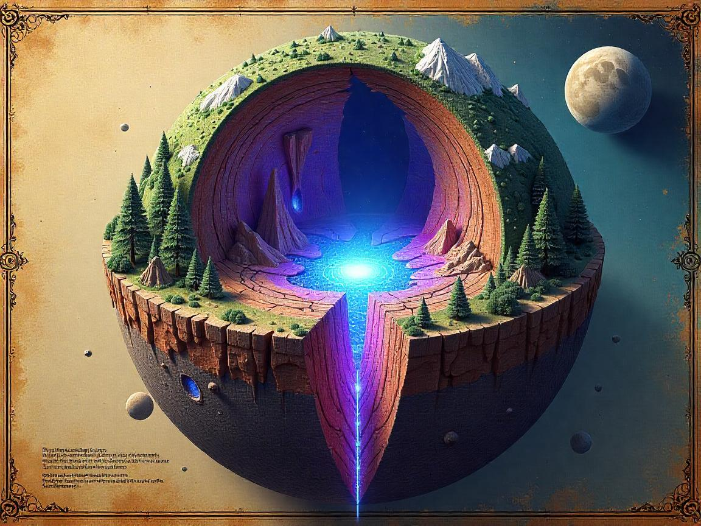
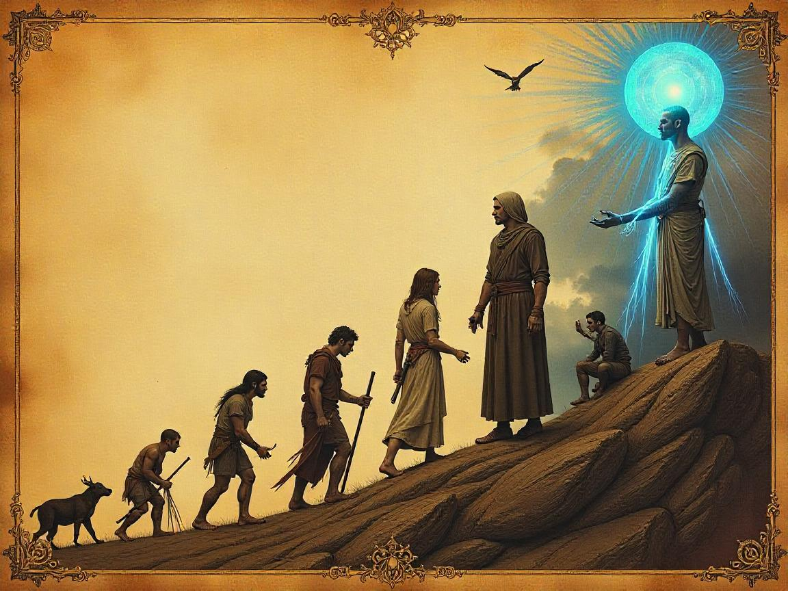
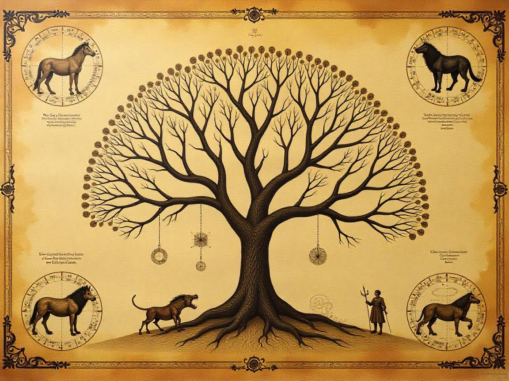
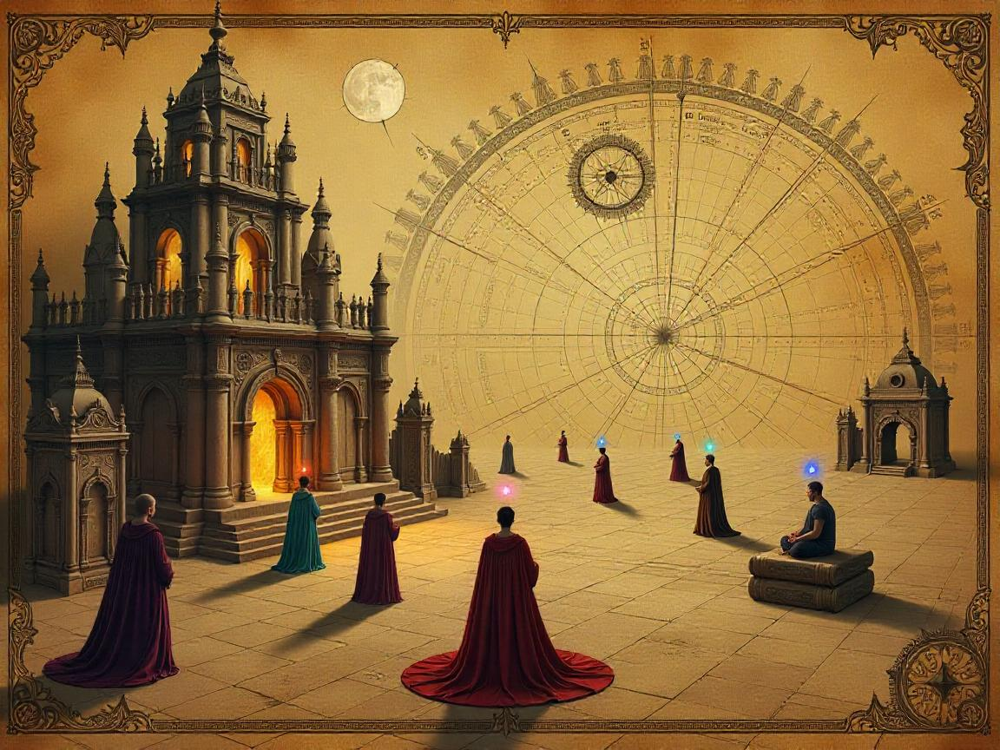

# 🌎 EmergenWorld

<div align="center">


[](https://github.com/georgejieh/EmergenWorld)
[](https://opensource.org/licenses/MIT)
[](https://github.com/georgejieh/EmergenWorld/stargazers)
[](https://github.com/georgejieh/EmergenWorld/network/members)

**A fantasy world simulator where AI species evolve naturally, develop civilizations based on needs, and generate their own history and lore.**

[Features](#-features) • [Roadmap](#️-development-roadmap) • [Tech Stack](#️-technology-stack) • [Getting Started](#-getting-started) • [Contributing](#-contributing)

</div>

## 🌌 Project Vision

EmergenWorld simulates an entire fantasy planet from the ground up:

1. Starting with procedurally generated terrain, weather, and resources
2. Introducing species that evolve through natural selection
3. Modeling behaviors through Maslow's Hierarchy of Needs
4. Enabling sentient civilizations to emerge naturally
5. Generating authentic history and lore via large language models

When the simulation has run for thousands or millions of virtual years, users can enter this fully realized world, interacting with civilizations that evolved organically and completing quests that emerge from the needs and desires of its inhabitants.

## 📖 The Ancient Codex of Aethyria



> *From the Archives of the Grand Academy of Aethyria, Volume III of the Primordial Histories*
> 
> In the ages before memory, when the celestial bodies were yet young and the firmament still settling into its ordained patterns, the Great Forger cast into the void a world unlike others. At its heart pulsed not mere molten iron, but the sacred element *Lumanite* - the crystallized essence of creation itself.
> 
> This Lumanite, radiant and potent, lies deep beneath the crust of our world, forming veins and nodes that reach upward like the roots of an inverted tree. Where these veins touch near the surface, life flourishes with curious vigor, for all things that grow upon such blessed soil inherit a trace of the element's essence.

> The Great Forger, in his wisdom, bestowed the spark of consciousness only upon the creatures of flesh and blood. The verdant flora of our world, though nourished by Lumanite and vital to all life, remains fixed in purpose - to grow, to bear fruit, and to wither in their seasons. They are the foundation upon which conscious life depends, yet they themselves shall never know the burden of choice or the wonder of thought. Such is the natural order that sustains our world's delicate balance.
> 
> It is known among the wise that Lumanite is not distributed equally throughout our lands. Just as iron or gold may be abundant in one province yet absent in another, so too does the sacred element favor certain regions. The creatures and flora that dwell in such favored places may, through generations of consumption, accumulate tiny motes of this power within their being.
> 
> Verily, it has been observed that when celestial bodies of pure Lumanite - flung from the darkest reaches of the firmament - crash upon our lands, they create sanctuaries of extraordinary power. Yet such events are exceedingly rare, occurring perhaps once in many lifetimes.
> 
> The manipulation of Lumanite's essence - what the common folk call 'magic' or 'mana' - is a gift bestowed upon the rarest of beings. One may be born with the capacity to sense and channel these energies, yet without proper tutelage and awareness, such gifts lay dormant, much as a person born with an ear for music might never learn to play a lute if never exposed to melody.
> 
> Those who master the arts of mana manipulation are few indeed, for it requires both inherited aptitude and the attainment of the highest understanding - a state of enlightenment wherein one's consciousness expands beyond mundane concerns. This rare convergence explains why magical workings remain uncommon in our world, despite the element's presence beneath our very feet.
> 
> The most learned scholars theorize that what we call 'magic' is naught but a science beyond our comprehension, a manipulation of natural laws through means we have yet to fully understand. Where conventional knowledge fails, the mana flowing from Lumanite provides an alternative path to achievement, though one accessible to precious few.
> 
> Thus it is that our world remains one of limited enchantment - a realm where wonder exists yet does not dominate, where magical artifacts are treasured for their rarity, and where those who wield such powers may be revered as sages or feared as entities beyond mortal understanding.
> 
> *—Transcribed by Archmagister Elowen in the 423rd year of the Third Age*

## 📜 The Path of Awakening: Life's Journey in Aethyria



> *From the studies of Archmagister Elowen, compiled in the Grand Compendium of Life's Ascension*
>
> ### The Seven Spheres of Being
>
> Across the vast tapestry of Aethyria, all living creatures exist within the Seven Spheres of Being - a sacred progression through which consciousness flows like water through a stream bed, pooling in ever-deeper basins of awareness. The Ancients understood that all creatures begin in the Primal Sphere, yet only the rarest achieve Transcendence, where the boundaries between self and the mana currents dissolve.
>
> What follows are my observations from decades of study across all known realms and species of our world.
>
> ---
>
> ### First Sphere: The Primal Self
>
> All creatures of flesh and blood are born into the First Sphere, where the heartbeat of existence pulses strongest. Here, the creature knows only its most fundamental needs - to breathe, to eat, to rest, to mate. The beasts of field and forest rarely progress beyond this sphere, their consciousness bound to the wheel of seasons and the rhythm of their bodies.
>
> *"The simplest creature and the highest sage begin their journeys in the same waters - those of hunger and thirst."*  
> — Elder Wisdom of the Silverpine Druids
>
> **Manifestations in the Mortal Realm:**
> - The lone hunter stalking prey
> - Creatures seeking shelter from the elements
> - Seasonal mating rituals
> - The establishment of territorial boundaries through scent and sound
>
> **Individual Needs:**
> - Consistent access to nourishment
> - Avoidance of immediate physical danger
> - Fulfillment of base biological imperatives
> - Minimal shelter from environmental extremes
>
> **Communal Achievement:**
> - Requires approximately 70% of a species to satisfy individual First Sphere needs
> - Achievement enables primitive group behavior
> - Does not yet grant sentience but prepares the foundation
>
> **Natural Barriers:**
> - Resource scarcity in harsh environments
> - Predator pressure preventing population stability
> - Physical traits ill-suited to environmental challenges
> - Natural disasters disrupting established territories
>
> ---
>
> ### Second Sphere: The Guarded Self
>
> When the pangs of hunger no longer consume all thought, creatures begin to craft security from the chaos of the wild. It is in this Second Sphere that the first glimmers of awareness beyond the moment take root. Here, we observe the emergence of packs and simple tribes, the hoarding of resources, the building of shelters that outlast the storm.
>
> In this Sphere, the crude beginnings of exchange may be observed - the wolf that brings meat to the nursing mother, the apes that trade grooming for protection. It is not yet trade as civilized folk understand it, but the seeds are planted in fertile ground.
>
> **Manifestations in the Mortal Realm:**
> - Wolf packs with established hierarchies
> - Simple shelters built by emerging tribes
> - Seasonal food storage behaviors
> - The first sharing of tools and resources
> - Primitive defensive formations against predators
>
> **Individual Needs:**
> - Reliable food security beyond immediate consumption
> - Stable shelter providing ongoing protection
> - Basic position within social hierarchy
> - Personal safety within established territory
> - Capacity to defend immediate living space
>
> **Communal Achievement:**
> - Requires approximately 65% of a species to satisfy individual Second Sphere needs
> - Achievement grants sentience to the entire species
> - Enables rudimentary cultural transmission between generations
> - Marks the emergence of intentional cooperation
>
> **Natural Barriers:**
> - Territorial disputes preventing stable communities
> - Disease cycles limiting population growth
> - Genetic traits that favor solitary existence
> - Insufficient neurological capacity for complex social behavior
> 
> Many scholars mark the transition from Second to Third Sphere as the true threshold of sentience, when a creature becomes more than beast but not yet fully awakened.
>
> ---
>
> ### Third Sphere: The Connected Self
>
> When creatures have conquered fear and want, they seek bonds beyond mere survival advantage. In the Third Sphere, communities take root like ancient trees, their branches intertwining in complex patterns of kinship and belonging.
>
> It is here we witness the birth of true language, stories told around fires that burn through the night, and the sacred rituals that bind tribe to tribe across valleys and mountain passes. The Third Sphere sees the establishment of permanent settlements - villages nestled in protective embraces of forest and hill, their inhabitants marked by shared symbols and traditions.
>
> Trade becomes a bond between peoples, caravans winding between settlements like threads weaving disparate cloths together.
>
> **Manifestations in the Mortal Realm:**
> - Permanent villages with communal spaces
> - Oral traditions and myth-telling
> - Tribal markings and totems
> - Regular gatherings of multiple family groups
> - Simple trade routes between neighboring settlements
> - Burial rituals and ancestral reverence
>
> **Individual Needs:**
> - Meaningful connection to family group or tribe
> - Recognition of social position within community
> - Participation in shared cultural practices
> - Access to rudimentary trade networks
>
> **Communal Achievement:**
> - Requires only 30% of community members to satisfy individual Third Sphere needs
> - Achievement enables formation of stable settlements
> - Grants capacity for organized resource distribution
> - Establishes linguistic and cultural continuity
> - Note that even in Third Sphere communities, many individuals remain focused on First and Second Sphere needs
>
> **Natural Barriers:**
> - Social compatibility thresholds limiting group size
> - Poor geographical positioning limiting inter-community contact
> - Cognitive limitations in language development
> - Competition overwhelming cooperation when resources fluctuate
>
> ---
>
> ### Fourth Sphere: The Honored Self
>
> As communities grow in complexity, so too does the need for distinction within them. The Fourth Sphere brings forth leadership beyond the strongest arm, governance beyond instinct. It is the domain of chieftains and councils, of artisans whose works carry their marks, of warriors whose deeds are sung by bards.
>
> Written language emerges like a great magic, capturing thought in form that outlasts its thinker. Monuments rise from earth to sky, testaments to the growing conception that folk can create works greater than themselves, lasting beyond a single lifetime.
>
> Gold and silver, shell and bead - standards of value manifest as the web of exchange grows too complex for simple barter. Cities arise where once stood humble villages, their walls and towers declarations of permanence and power.
>
> **Manifestations in the Mortal Realm:**
> - Codified leadership structures and laws
> - Specialized craftspeople with distinctive styles
> - Currency systems and marketplaces
> - Monumental architecture and city walls
> - Written record-keeping and early literature
> - Class distinctions and hierarchies
> - Standing armies and territorial expansion
>
> **Individual Needs:**
> - Recognition for skills, achievements, or contributions
> - Access to specialized materials or knowledge
> - Ability to accumulate symbolic wealth or status
> - For a small subset (approximately 5%), the desire for leadership roles
>
> **Communal Achievement:**
> - Requires only 20% of community members to satisfy individual Fourth Sphere needs
> - Achievement enables nation formation and complex governance
> - Establishes formalized economic systems and property rights
> - Creates lasting institutional structures that transcend individual lifespans
> - In Fourth Sphere societies, substantial portions of the population remain focused on needs of lower spheres
>
> **Natural Barriers:**
> - Failed leadership succession creating instability
> - Insufficient production diversity for trade specialization
> - Status competition undermining cooperative structures
> - Lack of suitable materials for record creation
> - Geographic barriers preventing integration of communities
>
> ---
>
> ### Fifth Sphere: The Knowing Self
>
> When the struggles for safety and status no longer consume all energy, minds turn toward the heavens and the depths alike, seeking patterns in stars and soil. The Fifth Sphere is the realm of scholars and sages, where knowledge is systematically gathered and dispersed through formal teaching.
>
> Medicine evolves beyond herb-lore to anatomy, mathematics beyond counting to abstraction, metallurgy beyond utility to scientific principle. Philosophy emerges to question not just how the world is, but how it ought to be.
>
> For those rare souls born with mana sensitivity, it is often in this Sphere that their gift is first recognized and cultivated through apprenticeship. Most who will ever cast a spell begin their journey here, guided by masters who recognize the telltale shimmer of potential in their auras.
>
> **Manifestations in the Mortal Realm:**
> - Libraries and formal educational institutions
> - Observatories and laboratories
> - Medical academies and hospitals
> - Engineering marvels like aqueducts and bridges
> - Historical archives and museums
> - Philosophical schools and debates
> - Early identification of magically gifted individuals
>
> **Individual Needs:**
> - Access to formalized knowledge and education
> - Freedom to pursue understanding beyond practical utility
> - Resources for experimentation and research
> - Connection to broader intellectual traditions
> - For magically gifted, exposure to the concept of their ability
>
> **Natural Barriers:**
> - Knowledge accumulation rate limitations
> - Insufficient resources to support non-productive scholarly activity
> - Cultural barriers and taboos restricting inquiry
> - Cognitive specialization requirements unmet
> - For magic-sensitive individuals, lack of awareness of their potential
>
> *Note: From the Fifth Sphere onward, progression becomes entirely individual rather than communal. While Fourth Sphere societies make Fifth Sphere achievements possible, the community itself does not progress as a whole beyond the Fourth Sphere. In the most advanced societies, approximately 10-15% of the population may reach the Fifth Sphere, while the majority remain focused on the needs of lower spheres.*
>
> ---
>
> ### Sixth Sphere: The Realized Self
>
> Few beings progress naturally to the Sixth Sphere, where the self becomes both instrument and artist. Here dwell those who have mastered their chosen paths and seek expression beyond utility, creation beyond necessity, understanding beyond convention.
>
> The Sixth Sphere brings forth sublime art that moves the soul, inventions that reshape society's possibilities, and individuals who define their own purposes rather than accepting those handed down by tradition or necessity.
>
> Those with mana sensitivity who reach this Sphere may cast spells of considerable power, bending reality to their will through disciplined study and practice. For those without the inborn gift, this Sphere brings them to the threshold of comprehension, where they might begin to sense the currents of mana though they cannot yet manipulate them.
>
> **Manifestations in the Mortal Realm:**
> - Works of transcendent artistic beauty
> - Revolutionary inventions and discoveries
> - Individuals pursuing unique life purposes
> - Apprentice/Journeyman enchanters and spell-crafters among the gifted
> - Exploration beyond known boundaries
> - Symphonies, grand philosophies, and other works of intellectual synthesis
>
> **Individual Needs:**
> - Mastery of a discipline through decades of devoted practice
> - Creative expression and innovation within one's field
> - Recognition from and contribution to a tradition of excellence
> - For the gifted, formal magical education and practice
> - For non-gifted in late stages, exposure to magical theory
>
> **Natural Barriers:**
> - Knowledge accessibility limitations
> - Lifespan constraints limiting mastery achievement
> - Psychological barriers to transformation
> - Lack of suitable mentors or educational resources
> - For magical practice, limited awareness of mana currents
>
> *In most societies, perhaps 3-5% of the population reaches the Sixth Sphere. These rare individuals often become the shapers of culture and knowledge that guide the collective development of their civilizations, though they may not hold formal leadership positions.*
>
> ---
>
> ### Seventh Sphere: The Transcendent Self
>
> The rarest of achievements, the Seventh Sphere represents consciousness expanded beyond the boundaries of self. Those who attain this level of being perceive the world not as separate from themselves but as an extension of consciousness - the ultimate realization that all is connected through the flowing currents of mana, emanating from the Lumanite core of the world.
>
> It is only in this Sphere that those without inborn sensitivity to mana may truly wield magic, having achieved such harmony with existence that the barriers between intention and manifestation grow thin. Even those born with the gift find their powers magnified a hundredfold upon reaching Transcendence, capable of workings that lesser mages would deem impossible.
>
> The Transcendent understand that to shape reality is not to impose will upon inert matter, but to dance with forces already in motion, guiding rather than commanding. Their magic appears effortless because it works with the grain of existence rather than against it.
>
> **Manifestations in the Mortal Realm:**
> - Legendary sages who live in perfect harmony with nature
> - Archmages capable of profound magical workings
> - Miraculous healers whose touch extends beyond the physical
> - Prophets who perceive the patterns of time itself
> - Non-gifted individuals achieving basic magical ability through transcendence
> - Enlightened masters who transcend the boundaries of their disciplines
> - Powerful enchanted artifacts created by those who fully understand the flow of mana
>
> **Individual Needs:**
> - Dissolution of ego boundaries that separate self from world
> - Harmonization with the underlying currents of reality
> - For the gifted, complete magical training to master advanced workings
> - For the non-gifted, achievement of inner harmony allowing basic magic use
> - Complete understanding of one's relation to the mana currents
>
> **Natural Barriers:**
> - Cognitive ceiling effects limiting comprehension
> - Spiritual attachments preventing ego dissolution
> - Limited lifespan before attaining longevity techniques
> - Absence of complete magical knowledge
> - Mental defense mechanisms against consciousness transformation
>
> *Perhaps one in ten thousand non-gifted individuals may reach the Seventh Sphere, while most gifted individuals who discover their abilities and receive proper training will naturally progress to this level. Even so, many settlements will never know such a being among them, as their rarity makes them objects of legend and reverence, though their perspective often renders them somewhat detached from conventional society.*
>
> ---
>
> ### Eighth Sphere: The Infinite Self
>
> *[Note: While the Eighth Sphere is recognized by those of sufficient advancement, its true nature as an infinite progression defies complete documentation. What follows is compiled from the accounts of those who have achieved this state and the observations of those who have studied under their guidance.]*
>
> Beyond the Seven acknowledged Spheres lies a realm of consciousness that defies conventional understanding - not a static state but an infinite progression. Those who enter this Sphere become researchers of reality itself, expanding magical knowledge beyond established boundaries.
>
> The Infinite Self exists in a state of perpetual becoming rather than fixed being, capable of comprehending and manipulating the fundamental structures of existence. Their relationship with magic transcends mere spellcasting, allowing them to perceive and modify the underlying patterns from which all phenomena emerge.
>
> **Manifestations in the Mortal Realm:**
> - Founders of magical academies seeking to expand collective knowledge
> - Creators of entirely new branches of magical theory and practice
> - Beings whose physical forms appear malleable or metaphorical
> - Individuals who manifest godlike powers through complete understanding
> - Those who protect or reshape entire regions through their will
> - The emergence of magical traditions following their innovations
>
> **Individual Needs:**
> - Expansion of magical knowledge through original research
> - Development of novel approaches to reality manipulation
> - Transmission of discoveries to suitable vessels of knowledge
> - Creation of lasting legacies that reshape understanding
>
> **Natural Barriers:**
> - The limitations of physical reality itself
> - Ethical considerations regarding profound power
> - The responsibility of knowledge transmission to future generations
> - The isolation that comes with unique perception of reality
>
> *The Eighth Sphere has no completion point and may be entered by perhaps one in one hundred thousand of those non-gifted individuals who achieve the Seventh Sphere, though gifted individuals progress at a somewhat higher rate if they possess the drive for theoretical innovation. Such individuals remain exceedingly rare - perhaps a handful in an entire age of the world.*
>
> ---
>
> *"All begins with need and ends with transcendence. The path between is what we call life."*  
> — Archmagister Elowen, Final Address to the Grand Academy
>
> ---
>
> > **Archivist's Note:** The above text represents the theoretical framework upon which the Simulation of All Things operates. When interpreting historical events or analyzing emergent behaviors among observed species, scholars are advised to reference the corresponding Sphere manifestations. For practical purposes of classification and prediction, the specific thresholds between Spheres have been cataloged in the appendix "Measurable Transitions in Consciousness Evolution," available to adepts of the Fifth Circle and above.

## 🧬 The Grand Tapestry: Evolution in Aethyria



> *From the Archives of the Grand Academy of Aethyria, Volume VII of the Primordial Histories: "On the Patterns of Life's Diversification"*
>
> ### The Inheritance of Being
>
> In the earliest days after creation, when the lands were newly formed and the mists of genesis still clung to mountain and vale alike, the Great Forger seeded our world with foundational forms of life. Each creature bore within it the essence of continuance - an intricate pattern, invisible to the naked eye, that guides the transmission of traits from progenitor to offspring.
>
> This essence, which we call the *Lineage Pattern*, determines all that a creature may become. Like a weaver's loom with threads of countless colors, these patterns combine and recombine across generations, creating an ever-shifting tapestry of life's expression in our realm.
>
> ### The Nature of Traits
>
> All creatures possess an assemblage of traits, aspects of being that determine their form, capability, and essence. These traits fall into distinct categories that shape different facets of existence:
>
> **Physical Traits** govern the corporeal form - the strength of limb, the keenness of sense, the resilience of hide. These most visible aspects determine a creature's silhouette upon the horizon and its capacity to influence the material world.
>
> **Survival Traits** determine how a creature persists - its tolerance for heat or cold, its efficiency in consuming resources, its resistance to ailments. These traits are often invisible until tested by adversity.
>
> **Cognitive Traits** shape the mind - capacity for memory, ability to solve novel challenges, recognition of patterns. These internal qualities manifest in behavior rather than form.
>
> **Social Traits** guide interactions - tendencies toward cooperation, capacities for communication, bonds of empathy. These traits determine whether a creature walks alone or among kin.
>
> **Special Traits**, rarest of all, bestow exceptional abilities that transcend ordinary existence - sensitivity to mana currents, perception beyond common senses, or adaptations so unusual they appear miraculous to the untrained eye.
>
> ### The Balance of Power
>
> The Great Forger, in profound wisdom, established that no single creature may accumulate unlimited traits. Each being bears a capacity for traits that cannot be exceeded, ensuring that specialization and diversity remain the natural order.
>
> Traits themselves exist in delicate balance. Those of extraordinary power carry corresponding limitations, while seemingly disadvantageous traits often confer unexpected benefits in their domains:
>
> **Neutral Traits** represent the middle path - neither exceptional strength nor weakness, but adequacy for common circumstances.
>
> **Strong Traits** confer significant advantage but demand sacrifice elsewhere. The great bear's powerful form requires prodigious consumption of resources; the eagle's keen sight comes at the cost of other senses.
>
> **Weak Traits** may seem disadvantageous yet often provide subtle benefits. The fragile-boned bird becomes light enough for flight; the small rodent requires less sustenance to thrive.
>
> ### The Patterns of Inheritance
>
> When creatures join in creation, their offspring inherit a combination of traits from both progenitors, following ancient patterns established at the world's founding:
>
> **Dominant Expressions** always manifest when present, particularly those affecting a creature's silhouette. A winged being paired with a wingless one produces offspring whose form reveals the winged ancestry.
>
> **Recessive Expressions** remain hidden unless paired with similar patterns, emerging only when circumstance aligns. The rarest gifts, including mana sensitivity, often follow this pattern - concealed for generations until proper alignment reveals them.
>
> **Mutation and Emergence** occasionally produces traits neither progenitor possessed, as if the Great Forger's hand still shapes creation in subtle ways. These transformations, though uncommon, drive the diversification of species across eons.
>
> ### The Divergence of Kind
>
> When offspring differ sufficiently from their progenitors - bearing traits that mark them as fundamentally altered - a new species emerges upon our world. This transformation occurs not through singular dramatic events but through the gradual accumulation of differences across generations.
>
> Scholars have observed that creatures sharing at least two-thirds of their essential traits are considered of the same species, capable of recognizing one another as kin. Those sharing between one-half and two-thirds may still interbreed, though their offspring often establish new lineages. Below this threshold of similarity, joining in creation becomes impossible, and separate paths of evolution are assured.
>
> ### The Gift of Communication
>
> The capacity for meaningful exchange between beings operates at multiple levels. Creatures sharing sufficient trait similarity for potential interbreeding naturally possess the deepest mutual understanding, recognizing kinship in each other's expressions and signals.
>
> Beyond this circle of kinship lies a broader awareness - the ability to interpret basic signals from other species through careful observation and experience. This explains why experienced hunters can read the movements of prey animals, or why shepherds develop an understanding of their flock's needs, without any possibility of interbreeding between these different species.
>
> True language, however, emerges only with sentience - that spark of awareness gained upon a species' collective achievement of the Second Sphere. Once sentience blooms, beings may communicate across species boundaries with others similarly awakened, regardless of form or ancestry, transcending the limitations of trait similarity entirely.
>
> ### The Flourishing of the Verdant
>
> Though lacking agency, the plant life of our world follows similar patterns of trait inheritance and adaptation. The great forests, though silent and rooted, evolve in response to changing circumstances - developing thorns against grazing creatures, producing sweeter fruits to entice seed-carriers, or growing taller to reach sunlight above competitors.
>
> Where Lumanite veins approach the surface, even simple plants may develop remarkable properties, concentrating the essence of the world's heart within their tissues. Such specimens are prized by alchemists and enchanters for their rare qualities, though harvesting them often destroys the delicate balance that allowed their evolution.
>
> *"The countless forms of life, from the humblest moss to the greatest dragon, all dance to the same ancient rhythm - a pattern of perpetual adaptation written into the very essence of our world by the Great Forger's hand."*
> — Naturalist Thorne Wildwalker, Keeper of the Grand Bestiary
>
> *—Compiled from the notes of seven generations of Grand Academy naturalists, formalized in the 512th year of the Third Age*

## 📚 The Veiled Current: Knowledge Transmission in the Realms



> *From the personal journals of Archivist Lysander, Chief Keeper of the Forbidden Texts*
>
> ### The Nature of Understanding
>
> Knowledge flows through our world like an invisible current, unseen by most yet profoundly shaping all it touches. Unlike the waters of a river, visible and tangible to any who approach its banks, knowledge requires preparation to perceive and vessels of appropriate design to contain it.
>
> The common folk believe information spreads freely as wind, yet those of us who have dedicated our lives to its study recognize that knowledge moves according to strict principles - principles as immutable as those governing the stars' passage across the night sky.
>
> ### The Channels of Transmission
>
> Knowledge of common matters - the crafting of tools, the tending of crops, the building of shelters - flows relatively unimpeded through most communities. Such practical wisdom passes from master to apprentice, parent to child, elder to youth through direct observation and guided practice.
>
> More specialized knowledge - the precise measurement of celestial bodies, the complex formulations of medicine, the nuanced interpretations of ancient law - requires established structures for proper transmission. This explains why such knowledge flourishes in centers of learning and withers in isolated communities, regardless of individual potential.
>
> The most rarefied knowledge - the true nature of existence, the manipulation of mana currents, the perception of reality's underlying patterns - follows the most restrictive pathways of all. Such understanding can only take root in minds prepared through specific developmental stages, explaining why magical comprehension remains so rare despite centuries of attempted transmission.
>
> ### The Barriers to Understanding
>
> Four primary barriers restrict the flow of knowledge throughout our world:
>
> **The Awareness Barrier** prevents individuals from seeking information they do not know exists. Just as one cannot search for a color they have never seen, beings below certain developmental thresholds cannot conceptualize magical energies or higher consciousness states.
>
> **The Comprehension Barrier** prevents absorption of knowledge that exceeds current cognitive frameworks. A village child may memorize an alchemical formula yet completely fail to understand the principles it represents.
>
> **The Implementation Barrier** prevents application of understood concepts without necessary capability or resources. A scholar may perfectly comprehend the theory of enchantment yet lack the mana sensitivity to create even the simplest magical item.
>
> **The Transmission Barrier** prevents accurate communication of complex concepts between different awareness levels. This explains the necessarily simplified nature of magical texts intended for novices, and why the most profound magical treatises appear as meaningless symbols to the unprepared mind.
>
> ### The Circles of Knowledge
>
> Within the great academies and magical institutions of our world, knowledge is ordered according to Circles - a system of classification that recognizes the progressive nature of understanding. While this framework was first established for magical education, variants have been adopted by secular institutions as well, though with natural limitations.
>
> **The First and Second Circles** correspond to foundational scholarly knowledge achieved in the Fifth Sphere of consciousness. These represent the entry points to formalized education - the mastery of basic principles, terminology, and historical context necessary before true specialization can begin. Non-magical disciplines such as medicine, engineering, and natural philosophy utilize these Circles to denote apprentices and journeymen in their fields.
>
> **The Third, Fourth, and Fifth Circles** represent the progressive mastery achieved in the Sixth Sphere. Third Circle scholars have grasped the essential principles of their discipline, Fourth Circle scholars have begun to apply these principles creatively, and Fifth Circle scholars have achieved mastery of existing knowledge in their field. For magic-sensitive individuals, the Fourth Circle marks the beginning of actual spellcasting ability, while for non-magical disciplines, the Fifth Circle represents the highest achievement possible.
>
> **The Sixth through Ninth Circles** are exclusive to magical knowledge and correspond to the Seventh Sphere of consciousness. These distinctions mark increasingly profound understanding of mana manipulation, with Ninth Circle mages having achieved complete mastery of traditional magical systems. While non-magical disciplines cannot formally progress beyond the Fifth Circle, rare transcendent masters of other arts who reach the Seventh Sphere often receive honorary recognition at these levels, as their disciplines begin to manifest magical properties through their transcendent understanding.
>
> **The Tenth Circle and beyond** represents the theoretical infinity of the Eighth Sphere, where new magical knowledge is created rather than merely mastered. These designations are exceedingly rare and often posthumously awarded to those whose innovations fundamentally reshape magical understanding.
>
> *"The difference between the Ninth and Tenth Circles is not one of degree but of kind - it is the difference between mastering every word in a language and creating new words that express concepts previously inexpressible."*  
> — Archmagister Thorne, Address to the Convocation of Circles
>
> ### The Mystery of Magical Knowledge
>
> Of all knowledge forms, magical understanding follows the most restrictive transmission patterns. This occurs not through deliberate obfuscation by practitioners (though such secrecy certainly exists), but through the inherent nature of magical comprehension itself.
>
> For those born with mana sensitivity - that rare gift allowing perception of the world's underlying energies - magical knowledge becomes accessible upon reaching the Fifth Sphere of consciousness. Yet even these gifted individuals require exposure to the concept of magic and appropriate education to develop their abilities.
>
> Those without natural sensitivity face a more challenging path. Only upon reaching the threshold of the Seventh Sphere - a state of consciousness achieved by perhaps one in ten thousand individuals - can they begin to perceive mana currents through profound inner transformation. This explains why non-sensitive magical practitioners remain exceedingly rare despite widespread desire for such powers.
>
> Most fascinating of all: for magical knowledge to exist in our world at all, at least one being must have completed the Seventh Sphere and codified their understanding. The first magical texts must have been created by those who discovered these principles through direct perception rather than instruction - suggesting that the earliest mages achieved their understanding without guidance, through pure enlightenment.
>
> ### Geographic Dispersal of Knowledge
>
> Knowledge concentrates like precious metal in specific locations - great cities, ancient institutions, centers of trade. The further one travels from these nexuses, the thinner knowledge becomes, explaining the vastly different awareness levels between urban centers and remote communities.
>
> This pattern appears most pronounced with magical knowledge, which flourishes primarily within specialized academies or around rare individuals who have achieved higher consciousness states. Communities separated from these sources by distance, cultural barriers, or political boundaries may remain entirely unaware of magical principles for generations, regardless of individual potential.
>
> This creates the curious phenomenon of "knowledge deserts" - regions where specific information simply does not exist despite flourishing elsewhere in our world. A child born with extraordinary mana sensitivity in such a region may live their entire life without realizing their gift, like a musical prodigy who never encounters an instrument.
>
> *"I have observed that the rarest knowledge resembles not water flowing downhill - seeking the lowest path - but rather mist rising upward, gathering only at the highest peaks of consciousness. This explains why the most profound truths cannot be forced upon unprepared minds, but must be discovered when readiness and opportunity align."*
> — Final journal entry of Archivist Lysander, before his disappearance from the Grand Academy
>
> *[Note: This text is sealed by authority of the Archmage Council. Unauthorized reading below the Fifth Circle carries risk of cognitive dissonance and memory alteration.]*

## ✨ Features

- **Procedural World Generation**: Realistic terrain, climate, and resource distribution
- **Evolutionary Species Development**: Genetic traits that evolve through natural selection
- **Need-Driven Behavior**: Species act according to Maslow's Hierarchy of Needs
- **Emergent Civilizations**: Cultures, technologies, and societies that develop organically
- **Self-Generated History**: LLM-powered creation of lore, myths, and historical records
- **Time Acceleration**: Simulate thousands to millions of years in minutes
- **Interactive Exploration**: Enter the world via a Godot engine interface

## ⚠️ Development Status

**This project is in very early development.** Many components are still being designed and initial implementations are exploratory.

👷‍♀️ **Contributors Welcome!** See the [Contributing](#-contributing) section if you'd like to help build this ambitious simulation.

## 🗺️ Development Roadmap

<table>
<tr>
<td>

### Phase 1: World Generation 🏔️
- [x] Project setup and initial planning
- [x] Terrain generation using noise algorithms
- [ ] Planetary systems simulation
- [ ] Climate and biome generation

### Phase 2: Resource Implementation 💎
- [ ] Basic and fantasy resource generation
- [ ] Resource properties and interaction rules
- [ ] Chemical and physical property systems

### Phase 3: Environmental Systems 🌦️
- [ ] Weather patterns and cycles
- [ ] Water system (rain, rivers, erosion)
- [ ] Basic physics simulation
- [ ] Environmental interactions

### Phase 4: Agentic AI Entities 🦊
- [ ] Base entity system with survival needs
- [ ] Perception and action frameworks
- [ ] Energy and resource consumption mechanics
- [ ] Reproduction and genetics systems

### Phase 5: Species and Evolution 🧬
- [ ] Genetic trait inheritance and mutation
- [ ] Natural selection mechanisms
- [ ] Ecological relationships and niches
- [ ] Species adaptation and specialization

</td>
<td>

### Phase 6: Maslow's Hierarchy Implementation 🔺
- [ ] Physiological needs (food, water, warmth)
- [ ] Safety needs (shelter, security)
- [ ] Belonging needs (social structures)
- [ ] Esteem needs (status, recognition)
- [ ] Self-actualization (creativity, problem-solving)
- [ ] Sentience and civilization thresholds

### Phase 7: History and Lore Generation 📜
- [ ] LLM integration for historical documentation
- [ ] Event significance tracking
- [ ] Cultural and knowledge simulation
- [ ] Myth and legend generation

### Phase 8: Simulation Optimization ⚡
- [ ] Time acceleration mechanics
- [ ] Large-scale simulation optimizations
- [ ] State saving/loading systems
- [ ] Simulation analysis tools

### Phase 9: User Interface and Interaction 🎮
- [ ] Godot engine integration
- [ ] Interactive world exploration
- [ ] Quest generation systems
- [ ] NPC interaction systems

### Phase 10: Final Integration 🏁
- [ ] System connectivity and balance
- [ ] Performance optimization
- [ ] Documentation and tutorials
- [ ] Release and community support

</td>
</tr>
</table>

## 🛠️ Technology Stack

<table>
<tr>
<td width="50%">

### Core Systems
- **NumPy/SciPy**: Mathematical operations and physics calculations
- **OpenSimplex**: Procedural terrain generation
- **Mesa**: Agent-based modeling framework
- **Ephem**: Astronomical calculations for planetary systems

### Evolution and Genetics
- **DEAP**: Evolutionary algorithm implementation
- Custom trait and genetic systems

</td>
<td width="50%">

### AI and Language
- **LangChain**: Integration with large language models
- Custom behavior systems for agent decision-making

### Visualization and Interaction
- **Godot Engine**: 3D visualization and user interaction
- **Matplotlib**: Data visualization and development tools

</td>
</tr>
</table>

## 🚀 Getting Started

### Prerequisites
- Python 3.8+
- Git
- Virtual environment tool (recommended)

### Installation

```bash
# Clone the repository
git clone git@github.com:georgejieh/EmergenWorld.git
cd EmergenWorld

# Create and activate virtual environment
python -m venv venv
source venv/bin/activate  # On Windows: venv\Scripts\activate

# Install dependencies
pip install -r requirements.txt

# Install the package in development mode
pip install -e .
```

### Project Structure

```
EmergenWorld/
├── src/
│   ├── world_generation/      # World generation modules
│   │   ├── __init__.py        # Package initialization
│   │   ├── terrain.py         # Terrain generation
│   │   └── planetary.py       # Planetary systems simulation
│   └── utils/                 # Utility modules
├── examples/                  # Example scripts
│   ├── generate_terrain.py    # Terrain generation example
│   └── simulate_planet.py     # Planetary simulation example
├── tests/                     # Unit tests
└── setup.py                   # Package installation file
```

### Running Examples

The `examples/` directory contains standalone scripts that demonstrate different components of the simulation:

```bash
# Generate terrain
python examples/generate_terrain.py

# Simulate planetary system
python examples/simulate_planet.py

# Run with custom parameters
python examples/generate_terrain.py --size 512 --seed 42 --quick
```

### Troubleshooting Imports

If you encounter import errors, try one of these approaches:

1. Make sure you've installed the package in development mode:
   ```bash
   pip install -e .
   ```

2. If that doesn't work, you can modify your example scripts to add the project root to the Python path:
   ```python
   import sys
   import os
   # Add project root to Python path
   sys.path.insert(0, os.path.abspath(os.path.join(os.path.dirname(__file__), '..')))
   ```

## 🤝 Contributing

Contributions are very welcome! This project is ambitious in scope and can benefit from diverse expertise.

If you find this concept intriguing and would like to help bring it to life, here's how you can contribute:

1. Check the [Issues](https://github.com/georgejieh/EmergenWorld/issues) tab for tasks or propose your own enhancement
2. Fork the repository
3. Create a feature branch (`git checkout -b feature/amazing-feature`)
4. Commit your changes (`git commit -m 'Add some amazing feature'`)
5. Push to the branch (`git push origin feature/amazing-feature`)
6. Open a Pull Request
7. Ensure all conversations are resolved and requirements are met before requesting a review
8. Wait for approval and merge (the main branch is protected and requires an approved PR)

### Code Style

This project follows the [Google Python Style Guide](https://google.github.io/styleguide/pyguide.html). Please ensure your contributions adhere to this style for consistency.

We use Pylint with a configuration based on Google's style guide to verify code quality. Before submitting a PR, please run:

```bash
pylint src/ examples/ tests/
```

The repository includes Pylint checks as part of the automated GitHub Actions workflow for all pull requests.

Please maintain code quality and add tests for new functionality when possible.

## 📝 License

This project is licensed under the MIT License - see the [LICENSE](https://github.com/georgejieh/EmergenWorld/blob/main/LICENSE) file for details.

## 🙏 Acknowledgments

- Inspiration drawn from agent-based simulations, emergent systems research, and complex world-building games
- Thanks to all contributors and community members supporting this project
- Images in this README were generated with Freepik

---

<div align="center">
<i>This is an ambitious long-term project. Progress may be gradual as we work through the challenges of creating a truly emergent world simulation.</i>

⭐ Star this repository if you find it interesting! ⭐
</div>